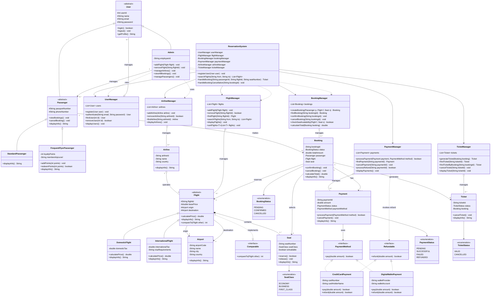

```mermaid


classDiagram

    %% USER MANAGEMENT

    class User {
        <<abstract>>
        #int userId
        #String name
        #String email
        #String password
        +login() boolean
        +logout() void
        +getProfile() String
    }

    class Admin {
        -String employeeId
        +addFlight(Flight flight) void
        +removeFlight(String flightId) void
        +manageAirlines() void
        +viewAllBookings() void
        +managePassengers() void
    }

    class Passenger {
        <<abstract>>
        #String passportNumber
        #String phoneNumber
        +viewBookings() void
        +cancelBooking() void
        +displayInfo() String
    }

    class StandardPassenger {
        +displayInfo() String
    }

    class FrequentFlyerPassenger {
        -int loyaltyPoints
        -String membershipLevel
        +addPoints(int points) void
        +redeemPoints(int points) boolean
        +displayInfo() String
    }

    class UserManager {
        -List~User~ users
        +register(User user) void
        +authenticate(String email, String password) User
        +findUser(int id) User
        +removeUser(int id) boolean
        +displayUsers() void
    }

    User <|-- Admin
    User <|-- Passenger
    Passenger <|-- StandardPassenger
    Passenger <|-- FrequentFlyerPassenger

    UserManager o-- "0..*" User : manages
    Admin "1" --> "0..*" Passenger : manages

    %% AIRLINE AND FLIGHT

    class Airline {
        -String airlineId
        -String name
        -String country
        +displayInfo() String
    }

    class Flight {
        <<abstract>>
        #String flightId
        #double basePrice
        #Airport origin
        #Airport destination
        +calculatePrice() double
        +displayInfo() String
        +compareTo(Flight other) int
    }

    class DomesticFlight {
        -double domesticTax
        +calculatePrice() double
        +displayInfo() String
    }

    class InternationalFlight {
        -double internationalTax
        -String visaRequirements
        +calculatePrice() double
        +displayInfo() String
    }

    class Airport {
        -String airportCode
        -String name
        -String city
        -String country
        +displayInfo() String
    }

    class FlightManager {
        -List~Flight~ flights
        +addFlight(Flight flight) void
        +removeFlight(String flightId) boolean
        +findFlight(String flightId) Flight
        +searchFlights(String from, String to) List~Flight~
        +displayFlights() void
        +sortFlights~T~(List~T~ flights) void
    }

    class AirlineManager {
        -List~Airline~ airlines
        +addAirline(Airline airline) void
        +removeAirline(String airlineId) boolean
        +findAirline(String airlineId) Airline
        +displayAirlines() void
    }

    class Comparable {
        <<interface>>
        +compareTo(Flight other) int
    }

    Flight <|-- DomesticFlight
    Flight <|-- InternationalFlight
    Flight ..|> Comparable : implements

    Airline "1" o-- "0..*" Flight : operates
    Flight --> "1" Airport : origin
    Flight --> "1" Airport : destination
    FlightManager o-- "0..*" Flight : manages
    AirlineManager o-- "0..*" Airline : manages

    %% SEAT AND BOOKING

    class Seat {
        -String seatNumber
        -SeatClass seatClass
        -boolean isAvailable
        +reserve() boolean
        +release() void
        +displayInfo() String
    }

    class Booking {
        -String bookingId
        -BookingStatus status
        -double totalAmount
        -Passenger passenger
        -Flight flight
        -Seat seat
        +confirmBooking() void
        +cancelBooking() void
        +calculateTotal() double
        +displayInfo() String
    }

    class BookingManager {
        -List~Booking~ bookings
        +createBooking(Passenger p, Flight f, Seat s) Booking
        +findBooking(String bookingId) Booking
        +confirmBooking(String bookingId) void
        +cancelBooking(String bookingId) void
        +checkSeatAvailability(Flight f, Seat s) boolean
        +calculateTotal(Booking booking) double
    }

    class SeatClass {
        <<enumeration>>
        ECONOMY
        BUSINESS
        FIRST_CLASS
    }

    class BookingStatus {
        <<enumeration>>
        PENDING
        CONFIRMED
        CANCELLED
    }

    Flight "1" *-- "1..*" Seat : contains
    Passenger "1" --> "0..*" Booking : makes
    Booking --> "1" Flight : reserves
    Booking --> "1" Seat : selects
    Booking --> BookingStatus
    Seat --> SeatClass
    BookingManager o-- "0..*" Booking : manages

    %% PAYMENT

    class Payment {
        -String paymentId
        -double amount
        -PaymentStatus status
        -PaymentMethod paymentMethod
        +processPayment(PaymentMethod method) boolean
        +cancelPayment() void
        +displayInfo() String
    }

    class PaymentMethod {
        <<interface>>
        +pay(double amount) boolean
    }

    class Refundable {
        <<interface>>
        +refund(double amount) boolean
    }

    class CreditCardPayment {
        -String cardNumber
        -String cardHolderName
        +pay(double amount) boolean
        +refund(double amount) boolean
    }

    class DigitalWalletPayment {
        -String walletProvider
        -String walletAccount
        +pay(double amount) boolean
        +refund(double amount) boolean
    }

    class PaymentManager {
        -List~Payment~ payments
        +processPayment(Payment payment, PaymentMethod method) boolean
        +findPayment(String paymentId) Payment
        +cancelPayment(String paymentId) void
        +processRefund(String paymentId) boolean
        +displayPayments() void
    }

    class PaymentStatus {
        <<enumeration>>
        PENDING
        SUCCESSFUL
        FAILED
        REFUNDED
    }

    PaymentMethod <|.. CreditCardPayment
    PaymentMethod <|.. DigitalWalletPayment

    Refundable <|.. CreditCardPayment
    Refundable <|.. DigitalWalletPayment

    Payment --> PaymentMethod : uses
    Payment --> PaymentStatus
    PaymentManager o-- "0..*" Payment : manages
    PaymentManager ..> Refundable : invokes refund

    Booking "1" --> "0..1" Payment : has

    %% TICKET MANAGEMENT

    class Ticket {
        -String ticketId
        -TicketStatus status
        -Booking booking
        +cancelTicket() void
        +displayInfo() String
    }

    class TicketManager {
        -List~Ticket~ tickets
        +generateTicket(Booking booking) Ticket
        +findTicket(String ticketId) Ticket
        +findTicketByBooking(String bookingId) Ticket
        +cancelTicket(String ticketId) void
        +displayTicket(String ticketId) void
    }

    class TicketStatus {
        <<enumeration>>
        VALID
        CANCELLED
    }

    Booking "1" --> "0..1" Ticket : generates
    Ticket --> TicketStatus
    TicketManager o-- "0..*" Ticket : manages

    %% SYSTEM COORDINATION

    class ReservationSystem {
        -UserManager userManager
        -FlightManager flightManager
        -BookingManager bookingManager
        -PaymentManager paymentManager
        -AirlineManager airlineManager
        -TicketManager ticketManager
        +registerUser(User user) void
        +searchFlights(String from, String to) List~Flight~
        +handleBooking(String passengerId, String flightId, String seatNumber) Ticket
        +handleBookingCancellation(String bookingId) void
    }

    ReservationSystem --> UserManager
    ReservationSystem --> FlightManager
    ReservationSystem --> BookingManager
    ReservationSystem --> PaymentManager
    ReservationSystem --> AirlineManager
    ReservationSystem --> TicketManager

    Admin ..> FlightManager : uses
    Admin ..> AirlineManager : uses
    Admin ..> BookingManager : views
    Admin ..> UserManager : uses


```
