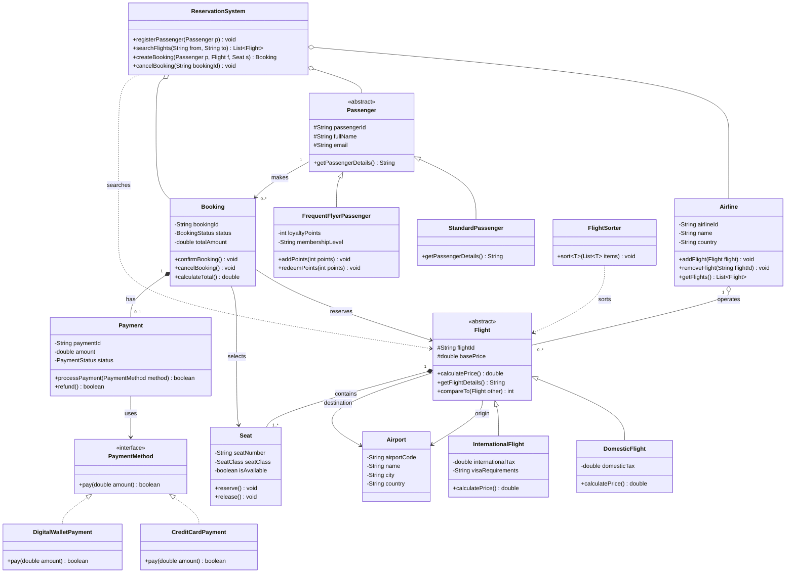

```mermaid


classDiagram
direction TB

class Airline {
  -String airlineId
  -String name
  -String country
  +addFlight(Flight flight) void
  +removeFlight(String flightId) void
  +getFlights() List~Flight~
}

class Flight {
  <<abstract>>
  #String flightId
  #double basePrice
  +calculatePrice() double
  +getFlightDetails() String
  +compareTo(Flight other) int
}

class DomesticFlight {
  -double domesticTax
  +calculatePrice() double
}

class InternationalFlight {
  -double internationalTax
  -String visaRequirements
  +calculatePrice() double
}

class Airport {
  -String airportCode
  -String name
  -String city
  -String country
}

class Passenger {
  <<abstract>>
  #String passengerId
  #String fullName
  #String email
  +getPassengerDetails() String
}

class StandardPassenger {
  +getPassengerDetails() String
}

class FrequentFlyerPassenger {
  -int loyaltyPoints
  -String membershipLevel
  +addPoints(int points) void
  +redeemPoints(int points) void
}

class Seat {
  -String seatNumber
  -SeatClass seatClass
  -boolean isAvailable
  +reserve() void
  +release() void
}

class Booking {
  -String bookingId
  -BookingStatus status
  -double totalAmount
  +confirmBooking() void
  +cancelBooking() void
  +calculateTotal() double
}

class Payment {
  -String paymentId
  -double amount
  -PaymentStatus status
  +processPayment(PaymentMethod method) boolean
  +refund() boolean
}

class PaymentMethod {
  <<interface>>
  +pay(double amount) boolean
}

class CreditCardPayment {
  +pay(double amount) boolean
}

class DigitalWalletPayment {
  +pay(double amount) boolean
}

class ReservationSystem {
  +registerPassenger(Passenger p) void
  +searchFlights(String from, String to) List~Flight~
  +createBooking(Passenger p, Flight f, Seat s) Booking
  +cancelBooking(String bookingId) void
}

class FlightSorter {
  +sort~T~(List~T~ items) void
}

Airline "1" o-- "0..*" Flight : operates
Flight <|-- DomesticFlight
Flight <|-- InternationalFlight
Flight --> Airport : origin
Flight --> Airport : destination
Flight "1" *-- "1..*" Seat : contains

Passenger <|-- StandardPassenger
Passenger <|-- FrequentFlyerPassenger

Passenger "1" --> "0..*" Booking : makes
Booking --> Flight : reserves
Booking --> Seat : selects
Booking "1" *-- "0..1" Payment : has

Payment --> PaymentMethod : uses
PaymentMethod <|.. CreditCardPayment
PaymentMethod <|.. DigitalWalletPayment

ReservationSystem o-- Airline
ReservationSystem o-- Passenger
ReservationSystem o-- Booking
ReservationSystem ..> Flight : searches

FlightSorter ..> Flight : sorts

```
